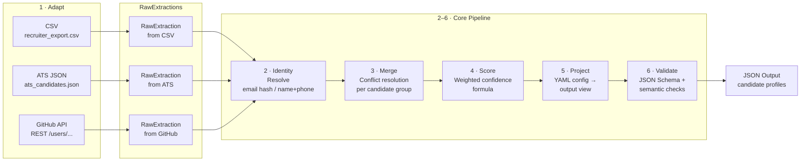
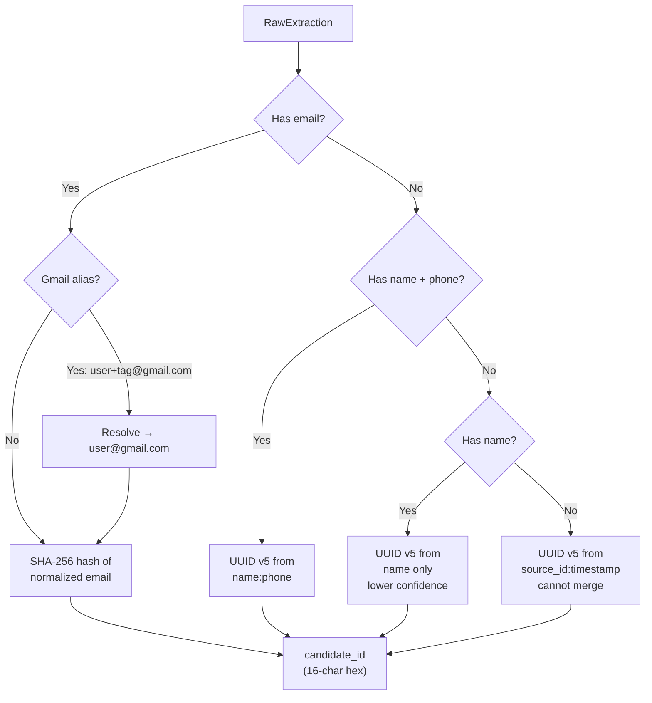
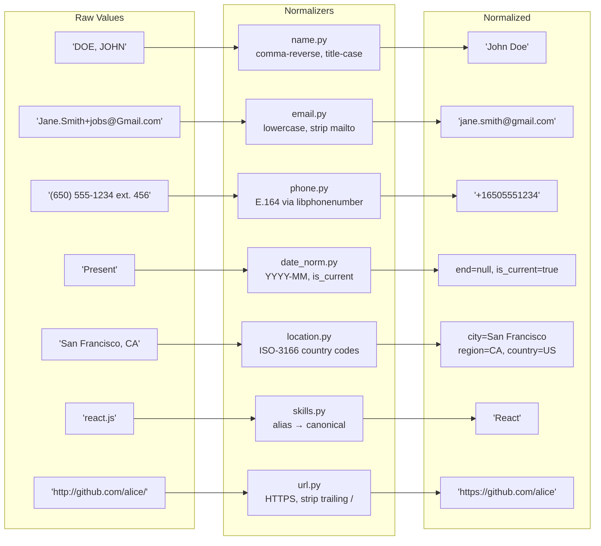
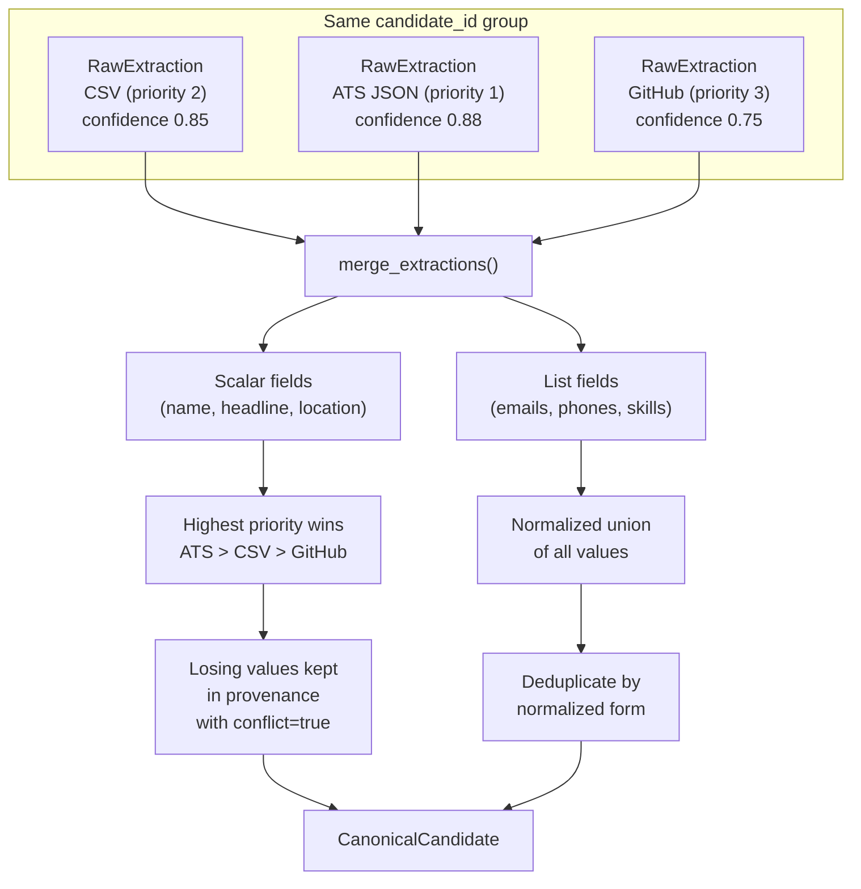
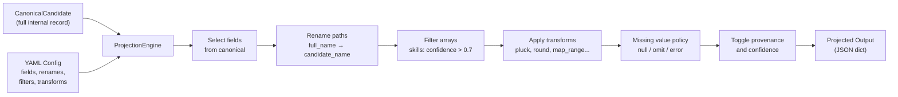

# Multi-Source Candidate Data Transformer

A production-quality pipeline that merges candidate data from multiple sources
into a single, trustworthy canonical profile — with normalization, deduplication,
provenance tracking, confidence scoring, and a configurable projection engine.

---

## Setup

```bash
git clone <repo-url>
cd EightFold

# Create virtual environment
python3 -m venv .venv
source .venv/bin/activate     # Windows: .venv\Scripts\activate

# Install dependencies
pip install -r requirements.txt
```

---

## Run the Pipeline

### Default output (full canonical schema)

```bash
# CSV source only
python3 -m transformer.cli --csv sample_inputs/recruiter_export.csv

# ATS JSON only
python3 -m transformer.cli --ats sample_inputs/ats_candidates.json

# Both structured sources merged
python3 -m transformer.cli \
  --csv sample_inputs/recruiter_export.csv \
  --ats sample_inputs/ats_candidates.json

# With a real GitHub public REST API profile call (unauthenticated: 60 req/hr limit)
python3 -m transformer.cli \
  --csv sample_inputs/recruiter_export.csv \
  --github https://github.com/torvalds

# With GitHub token (recommended for > 1 profile)
GITHUB_TOKEN=ghp_xxxx python3 -m transformer.cli \
  --csv sample_inputs/recruiter_export.csv \
  --github https://github.com/torvalds https://github.com/gvanrossum
```

`GitHubAdapter` calls `GET https://api.github.com/users/{username}` and
`GET https://api.github.com/users/{username}/repos`. If GitHub is unreachable,
rate-limited, or the profile is missing, the adapter returns no extraction and
the rest of the run still completes.

### Custom projection config

```bash
# ATS integration config (field renames, confidence filter on skills, no provenance)
python3 -m transformer.cli \
  --csv sample_inputs/recruiter_export.csv \
  --ats sample_inputs/ats_candidates.json \
  --config configs/ats_integration.yaml

# Save output to file
python3 -m transformer.cli \
  --csv sample_inputs/recruiter_export.csv \
  --ats sample_inputs/ats_candidates.json \
  --output results.json

# With visual summary table
python3 -m transformer.cli \
  --csv sample_inputs/recruiter_export.csv \
  --summary --log-level INFO
```

### Suppress provenance / confidence

```bash
python3 -m transformer.cli \
  --csv sample_inputs/recruiter_export.csv \
  --no-provenance --no-confidence
```

### Produced outputs

Fresh outputs generated from the included sample inputs are checked into:

- `outputs/default_output.json`
- `outputs/custom_ats_output.json`

Regenerate them with:

```bash
python3 -m transformer.cli \
  --csv sample_inputs/recruiter_export.csv \
  --ats sample_inputs/ats_candidates.json \
  --output outputs/default_output.json

python3 -m transformer.cli \
  --csv sample_inputs/recruiter_export.csv \
  --ats sample_inputs/ats_candidates.json \
  --config configs/ats_integration.yaml \
  --output outputs/custom_ats_output.json
```

---

## Run Tests

```bash
pytest tests/ -v

# Run only normalizer tests
pytest tests/test_normalizers.py -v

# Run only pipeline integration tests
pytest tests/test_pipeline.py -v
```

---

## Architecture

### Pipeline Flow



### Identity Resolution



### Normalization Detail



### Merge & Conflict Resolution



### Projection Engine



### Source Adapters

| Adapter | Source Type | Base Confidence |
|---|---|---|
| `CSVAdapter` | Recruiter CSV | 0.85 |
| `ATSJsonAdapter` | ATS JSON blob | 0.88 |
| `GitHubAdapter` | GitHub public API | 0.75 |

Adding a new source = write a new `SourceAdapter` subclass. Zero other changes.

### Normalization

| Field | Rule |
|---|---|
| Name | Title-case, comma-reversal, strip annotations |
| Email | Lowercase, strip `mailto:`, angle brackets |
| Phone | E.164 via Google libphonenumber (`phonenumbers`) |
| Date | `YYYY-MM` format, `Present` → `is_current=True` |
| Location | City/region/country, ISO-3166-1 alpha-2 country codes |
| Skills | Alias lookup → canonical name via `resources/skills_taxonomy.json` |
| URL | Force HTTPS, remove trailing slash |

### Merge & Conflict Resolution

Source priority (descending): ATS JSON → CSV → GitHub

- **Scalar fields** (name, location, headline): highest-priority source wins. All values kept in provenance with `conflict=True` flag.
- **List fields** (emails, phones, skills): union all, deduplicate by normalized form.
- **Skills**: merge `sources[]`, take max confidence. GitHub language skills penalized by ×0.85.
- **Experience**: deduplicate by `(company, title, start)`. Corroborated entries noted.

### Confidence Formula

```
field_confidence = base_source_confidence × extraction_method_multiplier
overall_confidence = weighted_avg(field_confidences)

# Hard cap: missing email OR name → overall_confidence ≤ 0.50
```

### Projection Engine

The projection layer is a config-driven view over the internal canonical record.
Configure it via YAML without changing any code.

```yaml
# configs/ats_integration.yaml
provenance: false
missing_value_policy: "omit"   # null | omit | error

fields:
  - source: "full_name"
    target: "candidate_name"
    required: true
  - source: "skills"
    target: "tech_skills"
    filter: "confidence > 0.7"
    transform: "pluck:name"
  - source: "years_experience"
    target: "seniority"
    transform: "map_range:[0,2]=Junior,[2,5]=Mid,[5,10]=Senior,[10,]=Staff"
```

Available transforms: `pluck`, `round`, `upper`, `lower`, `truncate`, `join`, `first`, `count`, `bool_from_path`, `map_range`

---

## Output Format

```json
{
  "run_id": "abc12345",
  "run_at": "2024-01-15T10:30:00Z",
  "pipeline_version": "1.0.0",
  "candidates_total": 5,
  "candidates": [
    {
      "candidate_id": "a1b2c3d4e5f6g7h8",
      "full_name": "Jane Smith",
      "emails": ["jane.smith@example.com"],
      "phones": ["+14155550101"],
      "location": { "city": "San Francisco", "region": "CA", "country": "US" },
      "headline": "Full-stack engineer with 8 years of experience",
      "skills": [
        { "name": "Python", "confidence": 0.850, "sources": ["csv:recruiter_export.csv", "ats_json:ats_candidates.json"] }
      ],
      "overall_confidence": 0.847,
      "provenance": [
        {
          "field": "full_name",
          "source": "csv:recruiter_export.csv",
          "method": "structured_field",
          "raw_value": "Jane Smith",
          "normalized_value": "Jane Smith",
          "confidence": 0.850,
          "conflict": false
        }
      ]
    }
  ]
}
```

---

## Design Decisions

**1. Provenance as a first-class data structure (not a log string)**  
Every field's value is traceable to its exact source, extraction method, raw value before normalization, and whether it conflicted with another source. This makes the system auditable and debuggable.

**2. "Wrong-but-confident is worse than honestly-empty"**  
The system never invents values. Missing data → `null`. Unknown skills → preserved as-is with `is_known=false`. Unparseable dates → `null`. This is enforced everywhere in the normalizers.

**3. Normalization before merge**  
All fields are normalized before the merge step. This ensures deduplication works correctly — `(650) 555-1234` and `6505551234` both become `+16505551234` before comparison.

**4. Projection as a view, not a mutation**  
The canonical record is always complete. The projection layer produces a view over it at the last step. This means you can add 10 new projection configs without touching the core pipeline.

**5. Adapter contract: never crash the pipeline**  
All adapters catch their own exceptions. A missing file, invalid JSON, or network timeout logs a warning and returns an empty list. The run continues with whatever other sources are available.

---

## Edge Cases Handled

- Empty CSV / JSON files → warning, skip
- Missing source files → warning, skip
- Invalid JSON → warning, skip
- Duplicate candidates across sources → merged by email hash
- Gmail `+` aliases (`user+jobs@gmail.com` = `user@gmail.com`) → resolved
- "DOE, JOHN" → "John Doe" (comma reversal)
- "Present" / "Current" → `is_current=True`, `end=null`
- Phone extensions (`ext. 456`) → stripped before E.164 parsing
- Unknown skills → preserved as-is with `is_known=false`
- GitHub rate limit → exponential backoff with jitter
- GitHub org URLs → rejected (not a user profile)
- Row with no name AND no email → skipped
- Conflicting values between sources → higher-priority source wins, both logged in provenance

---

## Project Structure

```
EightFold/
├── transformer/
│   ├── cli.py                 ← CLI entry point
│   ├── pipeline.py            ← 6-stage orchestrator
│   ├── confidence.py          ← confidence formula
│   ├── adapters/
│   │   ├── csv_adapter.py
│   │   ├── ats_json_adapter.py
│   │   └── github_adapter.py
│   ├── normalizers/           ← pure functions, fully unit-tested
│   ├── merge/                 ← identity resolution + conflict resolution
│   ├── projection/            ← config DSL + engine + transform registry
│   └── validation/            ← jsonschema + semantic validation
├── sample_inputs/             ← CSV and ATS JSON fixtures
├── configs/                   ← projection config YAMLs
├── resources/
│   └── skills_taxonomy.json   ← 100+ skill aliases → canonical names
├── tests/                     ← 50+ unit + integration tests
└── requirements.txt
```
